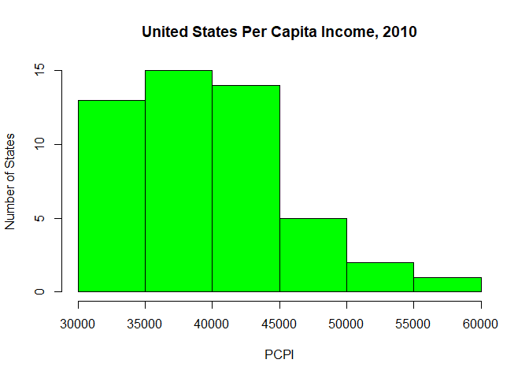
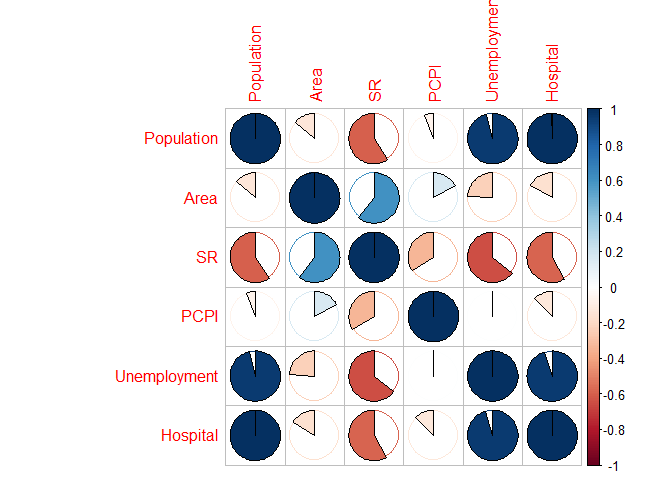

Drawing Correlations Between Unemployment, Per Capita Personal Income,
Hospital Availability, and Suicide Rates in the United States
================
J. Robert Quillen
6/4/2020

    ## corrplot 0.84 loaded

    ## -- Attaching packages ------------------------------------ tidyverse 1.3.0 --

    ## v tibble  3.0.1     v dplyr   1.0.0
    ## v tidyr   1.1.0     v stringr 1.4.0
    ## v readr   1.3.1     v forcats 0.5.0
    ## v purrr   0.3.4

    ## -- Conflicts --------------------------------------- tidyverse_conflicts() --
    ## x dplyr::combine() masks gridExtra::combine()
    ## x dplyr::filter()  masks stats::filter()
    ## x dplyr::lag()     masks stats::lag()

    ## 
    ## Attaching package: 'psych'

    ## The following objects are masked from 'package:ggplot2':
    ## 
    ##     %+%, alpha

# Introduction

## Overview

In an effort to complete this study, data was collected from a variety
of sources, including The Centers for Disease Control (suicide rates),
The United States Census Bureau (population), SSTI (PCPI), NCSI
(Unemployment), and the American Hospital Directory (Hospital Count).
All figures collected, aside from those reflected in historical suicide
rates, are representitive of historical figures reported in 2010.
Suicide rates were collected from 2005 - 2017; for the purpose of
statistical analysis, suicide rates for the year 2010 will be utilized
in order to remain consistant with other data present in this study.

This exploration aims to explore the connection between suicidality, per
capita personal income, unemployment, and hospital availablity in an
effort to gain insight into ways to lower the overal suicide rate.

## United States Suicide Rate

The overall rate of suicide in the United States has been on the rise
since 2007, as illustrated below.

<!-- -->

In 2010, State to State suicide rates range from a rate of 8.30 per
100,000 population (New Jersey and New York) to a rate of 25.20 per
100,000 population (Wyoming).

    ##    vars  n  mean   sd median trimmed  mad min  max range skew kurtosis   se
    ## X1    1 50 16.45 4.51   15.7   16.32 5.19 8.3 25.2  16.9 0.17    -0.77 0.64

<!-- -->

<!-- -->

For a look at how each State fairs with regard to their current overall
rate of suicide, please reference the bar chart below. (data reflective
of 2010 figures)

<!-- -->

## Unemployment and Suicide in the United States - 2010

In 2010, the average unemployment rate in the United States was 8.542
with a low of 3.80 (North Dakota) and high of 14.90 (Nevada). In an
effort to explore if unemployment rates potentially influenced rates of
suicide, a bivariate correlation was determined using the Pearson
method. Ultimately statistical analysis revealed a weak negative
correlation of -0.1309806 between rates of suicide in the United States
and unemployment.

    ##    vars  n mean   sd median trimmed mad min  max range skew kurtosis  se
    ## X1    1 50 8.54 2.12   8.55    8.52 1.7 3.8 14.9  11.1 0.21     0.49 0.3

<!-- -->

<!-- -->

The correlation between unemployment and rate of suicide is weak and
negative, as illustrated below.

    ## [1] -0.1309806

## United States Per Capita Personal Income (PCPI)

The average per capita personal income in the United States in 2010 was
39,440 with a low of 30,783 (Mississippi) and high of 57,347
(Connecticut). In an effort to explore if PCPI potentially influenced
rates of suicide, a bivariate correlation was determined using the
Pearson method. Ultimately statistical analysis revealed a moderate
negative correlation of -0.465929 between rates of suicide in the United
States and PCPI

    ##    vars  n     mean      sd  median  trimmed     mad   min   max range skew
    ## X1    1 50 39439.74 5912.88 38702.5 38832.18 5804.38 30783 57347 26564 0.83
    ##    kurtosis     se
    ## X1     0.28 836.21

<!-- -->

<!-- -->

The correlation between PCPI and rate of suicide is moderately negative,
as illustrated below.

    ## [1] -0.465929

## United States Hopsital Count Per State

The number of hospitals per state range from 7 (Vermont) to 365 (Texas)
with a mean of 76 hospitals per state. In an effort to explore if
hospitals per state potentially influenced rates of suicide, a bivariate
correlation was determined using the Pearson method. Ultimately
statistical analysis revealed a moderate negative correlation of
-0.3903531 between rates of suicide in the United States and hospital
count.

    ##    vars  n  mean    sd median trimmed   mad min max range skew kurtosis   se
    ## X1    1 50 76.86 74.93     59   62.77 50.41   7 365   358 2.13     5.11 10.6

<!-- -->

<!-- -->

    ## [1] -0.3903531

## CORRELATION DATA - IN PROGRESS

    ## # A tibble: 6 x 7
    ##   State      Population    Area    SR  PCPI Unemployment Hospital
    ##   <chr>           <dbl>   <dbl> <dbl> <dbl>        <dbl>    <dbl>
    ## 1 Alabama       4779736  52420.  16.5 34073          9.1       89
    ## 2 Alaska         710231 665384.  24.6 47773          7.9       10
    ## 3 Arizona       6392017 113990.  19.2 34185          9.6       73
    ## 4 Arkansas      2915918  53179.  18.3 31991          7.9       52
    ## 5 California   37254523 163695.  10.9 42411         12.5      343
    ## 6 Colorado      5029196 104094.  21.9 41877          8.9       55

    ##               Population       Area         SR         PCPI Unemployment
    ## Population    1.00000000 -0.1376521 -0.5924475 -0.060773229  0.959787275
    ## Area         -0.13765209  1.0000000  0.6068523  0.169556995 -0.238590596
    ## SR           -0.59244754  0.6068523  1.0000000 -0.338260305 -0.642249427
    ## PCPI         -0.06077323  0.1695570 -0.3382603  1.000000000  0.004393821
    ## Unemployment  0.95978727 -0.2385906 -0.6422494  0.004393821  1.000000000
    ## Hospital      0.99749672 -0.1653125 -0.5832403 -0.125189133  0.950690163
    ##                Hospital
    ## Population    0.9974967
    ## Area         -0.1653125
    ## SR           -0.5832403
    ## PCPI         -0.1251891
    ## Unemployment  0.9506902
    ## Hospital      1.0000000

<!-- -->

<!-- -->

## MAPS - IN PROGRESS
